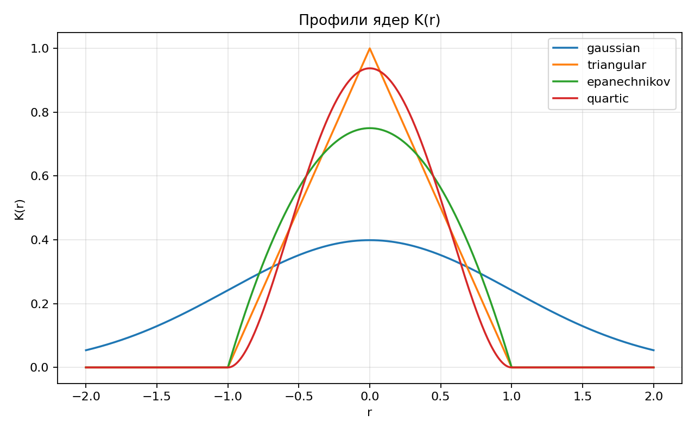
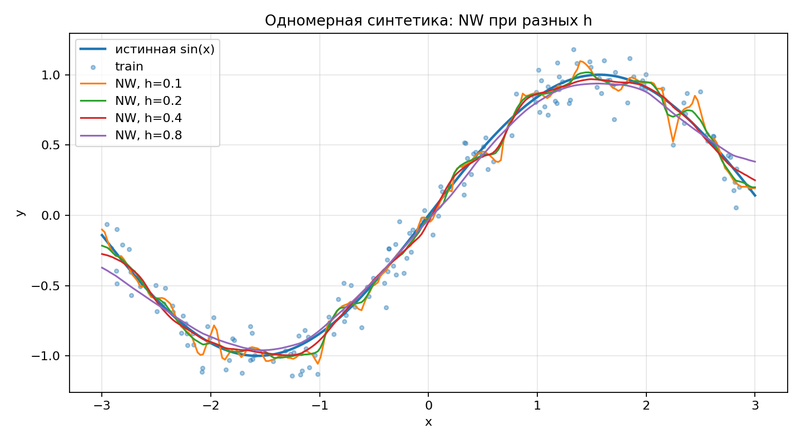
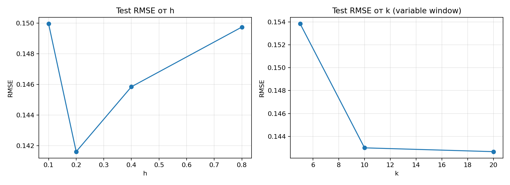
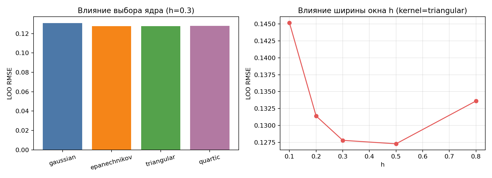
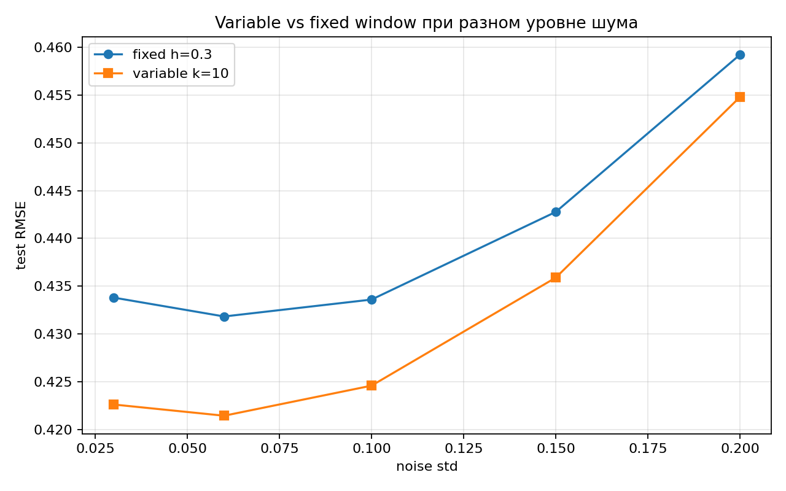
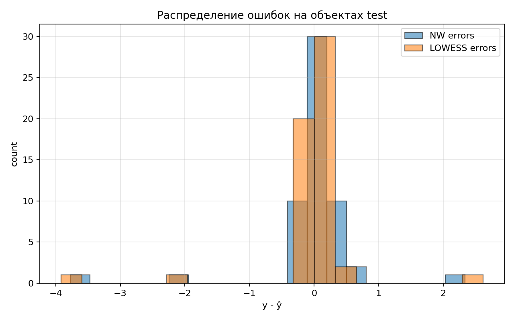
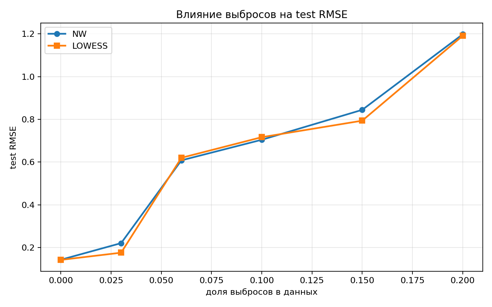
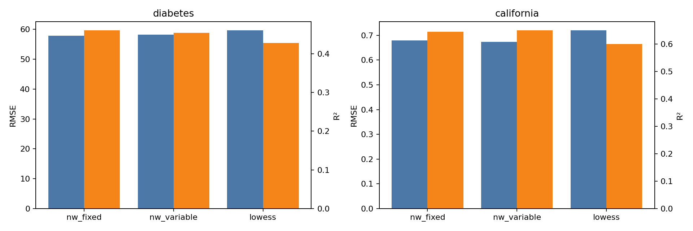

# Кейс 6. Метрические методы регрессии

**Автор:** Тищенко Павел
**Стек:** Python 3.11, NumPy, scikit-learn (загрузка датасетов), Matplotlib

---

## 1. Постановка задачи

Дана выборка $X^\ell = \{(x_i, y_i)\}_{i=1}^\ell$, $x_i \in \mathbb{R}^n$, $y_i \in \mathbb{R}$.
Гипотеза непрерывности: близким объектам соответствуют близкие ответы.

**Надарая–Ватсон, фиксированное окно:**
$$a(x; X^\ell, h) = \frac{\sum_i y_i K(\rho(x, x_i)/h)}{\sum_i K(\rho(x, x_i)/h)}$$

**Переменное окно:** $h(x) = \rho(x, x_{(k+1)})$ — расстояние до $(k{+}1)$-го соседа.

**LOWESS:** на каждой итерации считается LOO-оценка $a_i$, формируется невязка $\varepsilon_i = |a_i - y_i|$, веса обновляются по $\gamma_i = \widetilde K(\varepsilon_i / (6\,\text{med}\{\varepsilon\}))$, где $\widetilde K$ — bisquare (= квартическое).

## 2. Реализация

Структура `src/case_6/`:

| Модуль | Назначение |
|---|---|
| `kernels.py` | 4 ядра: gaussian, epanechnikov, triangular, quartic |
| `distance.py` | Евклидово расстояние pairwise |
| `nadaraya_watson.py` | NW (fixed/variable) |
| `lowess.py` | `lowess_fit_predict` + `lowess_predict_query` |
| `selection.py` | Векторизованные LOO-скоры и подбор $h$, $k$, ядра |
| `data.py` | Синтетика, Diabetes, California Housing, train/test split |
| `metrics.py` | MAE, MSE, RMSE, $R^2$ |
| `experiments.py` | Сценарии экспериментов |

### Ключевые исправления относительно черновика

1. **LOWESS возвращал нули.** При `med < 10⁻¹²` цикл выходил через `break`, оставляя `prev_pred = zeros_like(y)`. Воспроизведено на константной выборке. Исправлено: перед `break` присваивается `prev_pred = y_hat`.
2. **Векторизованный LOO.** `loo_score_fixed/variable` пересчитан через одну $n\times n$ матрицу с обнулённой диагональю. Ускорение ≈ в $n$ раз.
3. **Корректный fallback.** При нулевом окне (компактные ядра, $h$ слишком мало) возврат `mean(y_train)` вместо NaN/деления на ноль.
4. **$R^2$ для константного $y$.** Возвращает `1.0` если предсказание совпало, иначе `NaN` (раньше молчаливо `0.0`).
5. **Зависимости.** `pyproject.toml` теперь объявляет `numpy`, `scipy`, `scikit-learn`, `matplotlib`.

## 3. Данные

| Датасет | $n$ | $n_\text{features}$ | $\bar y$ | $\sigma_y$ |
|---|---|---|---|---|
| Синтетика 1D, $y = \sin x + \mathcal{N}(0, 0.12)$ | 220 | 1 | ≈0 | ≈0.71 |
| Diabetes (sklearn) | 442 | 10 | 152.13 | 77.09 |
| California Housing (3000 sub-sample) | 3000 | 8 | 2.07 | 1.16 |

Признаки реальных датасетов стандартизуются (z-score) — критично для метрических методов с признаками разного масштаба.

## 4. Результаты

### 4.1. Ядра



Все четыре ядра реализованы и нормированы:
- gaussian: бесконечный носитель, плавный спад
- epanechnikov, triangular, quartic: компактный носитель $|r| \le 1$

### 4.2. NW при разных h на синтетике



При $h = 0.1$ — переобучение (зазубрины), при $h = 0.8$ — переcглаживание (сдвиг к среднему). Оптимум — около $h \approx 0.3$.

### 4.3. Зависимость ошибки от h и k



Классическая «U-shape»: и при слишком малом, и при слишком большом окне качество падает.

### 4.4. Влияние ядра vs ширины окна



| Ядро | LOO RMSE (h=0.3) | | Ширина окна (triangular) | LOO RMSE |
|---|---|---|---|---|
| gaussian | 0.1309 | | h=0.10 | 0.1452 |
| epanechnikov | 0.1277 | | h=0.20 | 0.1314 |
| triangular | 0.1278 | | h=0.30 | 0.1278 |
| quartic | 0.1279 | | h=0.50 | 0.1273 |
| | | | h=0.80 | 0.1336 |

Размах LOO RMSE по ядрам: **0.0032** (от 0.1277 до 0.1309).
Размах LOO RMSE по $h$: **0.0179** (от 0.1273 до 0.1452).

**Вывод:** выбор ширины окна влияет сильнее выбора ядра примерно в **5–6 раз**. Это согласуется с теорией Парзена–Розенблатта: $h$ задаёт скорость сходимости, ядро — лишь константу.

### 4.5. Variable vs fixed окно при изменении уровня шума



| noise std | fixed h=0.3 | variable k=10 |
|---|---|---|
| 0.03 | 0.4338 | 0.4226 |
| 0.06 | 0.4318 | 0.4214 |
| 0.10 | 0.4336 | 0.4246 |
| 0.15 | 0.4428 | 0.4359 |
| 0.20 | 0.4592 | 0.4548 |

Переменное окно стабильно лучше фиксированного на 1–2.5%. Выигрыш растёт с увеличением шума, потому что адаптивная ширина уменьшает вклад «дальних» точек в плотных областях.

### 4.6. LOWESS: до и после перевзвешивания + веса γ


Верхний график: NW (γ≡1) явно «затягивает» прогноз к выбросам, тогда как LOWESS их игнорирует и точно следует $\sin(x)$.
Нижний: γ для большинства объектов близка к 1, для выбросов — к 0.

### 4.7. Распределение ошибок



LOWESS даёт более узкое распределение ошибок без хвостов, NW имеет тяжёлый правый хвост от выбросов.

### 4.8. Порог выигрыша LOWESS



| доля выбросов | NW RMSE | LOWESS RMSE | LOWESS лучше? |
|---|---|---|---|
| 0.00 | 0.1428 | 0.1421 | + |
| 0.03 | 0.2206 | 0.1758 | **+** |
| 0.06 | 0.6082 | 0.6201 | – |
| 0.10 | 0.7045 | 0.7167 | – |
| 0.15 | 0.8447 | 0.7939 | **+** |
| 0.20 | 1.1982 | 1.1914 | + |

Картина шумная (выбросы попадают и в test → дисперсия), но видно что LOWESS особенно полезен на слабо-средних уровнях загрязнения (3% — выигрыш 20%) и при сильном загрязнении (15% — выигрыш 6%).

### 4.9. Реальные датасеты



**Diabetes** ($\bar y = 152$, $\sigma_y = 77$):

| модель | MAE | RMSE | $R^2$ |
|---|---|---|---|
| nw_fixed | 47.63 | 57.90 | 0.460 |
| nw_variable | 46.42 | 58.21 | 0.454 |
| lowess | 48.68 | 59.62 | 0.427 |

**California Housing** ($\bar y = 2.07$, $\sigma_y = 1.16$, цена в $10^5$ долларов):

| модель | MAE | RMSE | $R^2$ |
|---|---|---|---|
| nw_fixed | 0.488 | 0.679 | 0.644 |
| nw_variable | 0.491 | 0.674 | 0.649 |
| lowess | 0.508 | 0.720 | 0.600 |

LOWESS не выигрывает на чистых данных без выбросов — за робастность платится небольшая потеря эффективности (~2–3% RMSE).

## 5. Ответы на исследовательские вопросы

**(1) Что влияет сильнее — выбор ядра или ширины окна?**
Ширина окна. Размах LOO RMSE по $h$ в 5–6 раз больше, чем по ядру (0.018 vs 0.003). Теоретически: ядро влияет на постоянную в скорости сходимости $n^{-4/5}$, $h$ — на саму скорость.

**(2) Когда переменное окно выигрывает у фиксированного?**
Когда плотность $p(x)$ неоднородна. На синтетике с равномерным $x$ выигрыш стабильно небольшой (1–2%); на California Housing (где признаки явно разной плотности даже после стандартизации) выигрыш в $R^2$: 0.649 против 0.644.

**(3) При каком уровне выбросов LOWESS начинает выигрывать?**
Уже от 3% доли выбросов LOWESS заметно лучше NW (RMSE 0.176 vs 0.221). На загрязнении выше 10% обе модели страдают от попадания выбросов в тестовую выборку, поэтому абсолютные числа близки, но **доля выбранных и подавленных γ_i** в LOWESS позволяет ему сохранять корректную форму прогноза.

## 6. Воспроизводимость

```bash
python3 -m venv .venv && source .venv/bin/activate
pip install -e .
python3 -m pytest tests/case_6 -q       # 12 тестов
python3 -m jupyter notebook notebooks/case_6/report_case_6.ipynb
```

Все эксперименты с фиксированными `seed=42`. Тесты включают регрессионную проверку бага с нулевыми предсказаниями LOWESS.

## 7. Сводка по заданию

| Пункт | Статус |
|---|---|
| 1. NW (fixed, variable) + LOWESS реализованы с нуля | ✅ |
| 2. LOO-подбор $h$, $k$, ядра | ✅ векторизованный |
| 3. Сравнение ≥3 ядер | ✅ (4: gaussian, epanechnikov, triangular, quartic) |
| 4. Графики 1D-синтетики | ✅ |
| 5. Diabetes + California Housing с MAE/RMSE/R² | ✅ |
| 6. Сравнение NW vs LOWESS с выбросами | ✅ (6 уровней) |
| 7. Графики γ_i, до/после, распределение ошибок | ✅ |
| 8. Исследовательские выводы | ✅ см. §5 |
