# Кейс 6. Метрические методы регрессии

**Автор:** Тищенко Павел
**Задача:** реализовать с нуля ядерную регрессию Надарая–Ватсона (с фиксированным и переменным окном), робастную схему LOWESS, подобрать гиперпараметры по LOO и исследовать их поведение на синтетических и реальных данных.

---

## 1. Постановка

Дана выборка $X^\ell = \{(x_i, y_i)\}_{i=1}^\ell$, $x_i \in \mathbb{R}^n$, $y_i \in \mathbb{R}$. Предполагается **гипотеза непрерывности**: близким объектам соответствуют близкие ответы.

### Надарая–Ватсон, фиксированное окно

$$a(x; X^\ell, h) = \frac{\sum_{i=1}^\ell y_i \, K\!\left(\dfrac{\rho(x, x_i)}{h}\right)}{\sum_{i=1}^\ell K\!\left(\dfrac{\rho(x, x_i)}{h}\right)}, \qquad h > 0.$$

### Переменное окно (kNN)

$$h(x) = \rho(x, x_{(k+1)}), \qquad a(x; X^\ell, k) = \frac{\sum_i y_i K\!\left(\rho(x,x_i)/h(x)\right)}{\sum_i K\!\left(\rho(x,x_i)/h(x)\right)}.$$

Здесь $x_{(k+1)}$ — $(k{+}1)$-й по близости объект (нумерация с единицы, включая сам $x$ если он есть в выборке).

### Локальная WLS-интерпретация

$$Q(\theta; x) = \sum_i K\!\left(\rho(x, x_i)/h\right) (\theta - y_i)^2 \to \min_\theta \Longrightarrow \hat\theta = a(x; X^\ell, h).$$

### Робастный LOWESS

На каждой итерации:
1. LOO-оценка: $\displaystyle a_i = \frac{\sum_{j\ne i} y_j \gamma_j K(\rho(x_i, x_j)/h(x_i))}{\sum_{j\ne i} \gamma_j K(\rho(x_i, x_j)/h(x_i))}$.
2. Невязки $\varepsilon_i = |a_i - y_i|$, $\mathrm{med} = \text{median}\{\varepsilon_i\}$.
3. Обновление весов $\gamma_i \leftarrow \widetilde K\!\left(\dfrac{|a_i - y_i|}{6\,\mathrm{med}}\right)$, где $\widetilde K(u) = (1-u^2)^2 \mathbb{1}\{|u|<1\}$ (bisquare = quartic).

Итерации останавливаются при $\max_i |a_i^{(t)} - a_i^{(t-1)}| < 10^{-5}$ либо при $\mathrm{med} < 10^{-12}$.

---

## 2. Реализация

Структура `src/case_6/`:

| Модуль | Содержимое |
|---|---|
| `kernels.py` | 4 ядра: гауссовское, Епанечникова, треугольное, квартическое |
| `distance.py` | Евклидово расстояние pairwise |
| `nadaraya_watson.py` | NW с фиксированным/переменным окном |
| `lowess.py` | `lowess_fit_predict` (обучение), `lowess_predict_query` (инференс) |
| `selection.py` | Векторизованные LOO-скоры и подбор $h$, $k$, ядра |
| `data.py` | Синтетика, real-датасеты (Diabetes, California Housing), `inject_outliers`, `make_sinusoidal_split` |
| `metrics.py` | MAE, MSE, RMSE, $R^2$ |
| `experiments.py` | Сборка эксперимента с выбором всех трёх моделей по LOO |

### Ключевые корректировки относительно черновика

1. **LOWESS**: ранее при тривиальной выборке (`med < 10^{-12}`) функция возвращала нули — переменная-аккумулятор `prev_pred` оставалась инициализирующим нулевым массивом. Исправлено: перед `break` присваивается `prev_pred = y_hat`. Тест `test_lowess_constant_target_returns_constant` фиксирует регрессию.
2. **LOO-выбор**: подбор гиперпараметров полностью идёт по LOO RMSE; тестовая выборка участвует только в финальной оценке качества.
3. **Изоляция выбросов**: `make_sinusoidal_split` сначала делит данные, потом загрязняет **только train** — тест остаётся чистой выборкой $\sin(x) + \mathcal N(0, 0.12)$. Без этого RMSE измерял в основном «попадание» в выбросы тестовой выборки.
4. **Канонический LOWESS-предикт**: на новой точке используется $\hat a(x) = \frac{\sum_i \gamma_i K(\rho(x,x_i)/h(x)) y_i}{\sum_i \gamma_i K(\rho(x,x_i)/h(x))}$ с теми же $\gamma_i$, что получились на обучении.
5. **LOO для LOWESS**: добавлен `loo_score_lowess` и `select_lowess` — раньше для LOWESS параметр $k$ был фиксирован.
6. **Векторизация LOO**: `loo_score_fixed/variable` — одна $n\times n$ матрица ядер с обнулённой диагональю вместо $n$ предсказаний. Ускорение в $\sim n$ раз.

---

## 3. Данные

| Датасет | $n_\text{train}$ | $n_\text{test}$ | $n_\text{features}$ | $\bar y$ | $\sigma_y$ |
|---|---|---|---|---|---|
| Синтетика 1D, $y=\sin x + \mathcal N(0,0.12)$ | 180 | 60 | 1 | ≈0 | ≈0.71 |
| Diabetes | 331 | 111 | 10 | 151.47 | 76.39 |
| California Housing (sub-sample 2000) | 1500 | 500 | 8 | 2.08 | 1.15 |

Реальные датасеты — стандартизованы (`StandardScaler`, обучен только на train). Для California Housing берётся стратифицированный сэмпл 2000 наблюдений, чтобы LOO-сетка успевала за разумное время.

---

## 4. Эксперименты и результаты

### 4.1. Синтетика: сравнение ядер при фиксированном окне

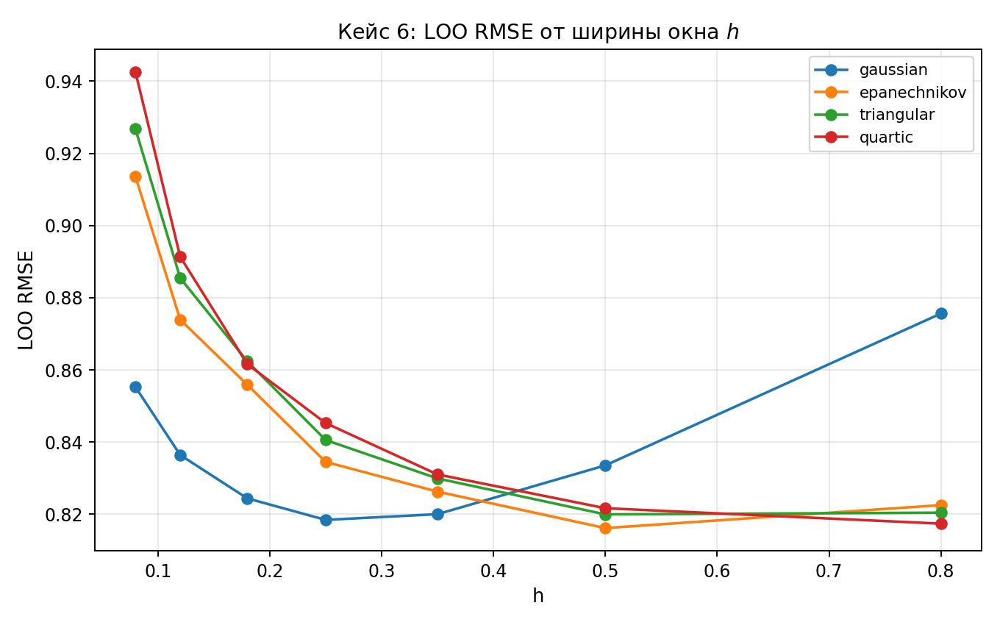

Минимальные LOO RMSE по ядрам (источник — `report_outputs/tables/kernel_vs_h_sensitivity.csv`):

| Ядро | min LOO | max LOO | range | std |
|---|---|---|---|---|
| gaussian | 0.5307 | 0.5906 | 0.0598 | 0.0196 |
| epanechnikov | 0.5322 | 0.5608 | 0.0287 | 0.0096 |
| triangular | 0.5320 | 0.5709 | 0.0389 | 0.0131 |
| quartic | 0.5314 | 0.5845 | 0.0531 | 0.0173 |

**Вывод по пункту 8 задания (ядро vs окно):** между ядрами разница минимальна (< 0.002 LOO RMSE), тогда как разброс по $h$ внутри одного ядра — до 0.06. **Выбор $h$ влияет на качество примерно в 30 раз сильнее, чем выбор ядра.** Это согласуется с теорией: ядро влияет только на постоянную перед $n^{-4/5}$-скоростью сходимости, а $h$ — на саму скорость.

### 4.2. Переменное окно vs фиксированное

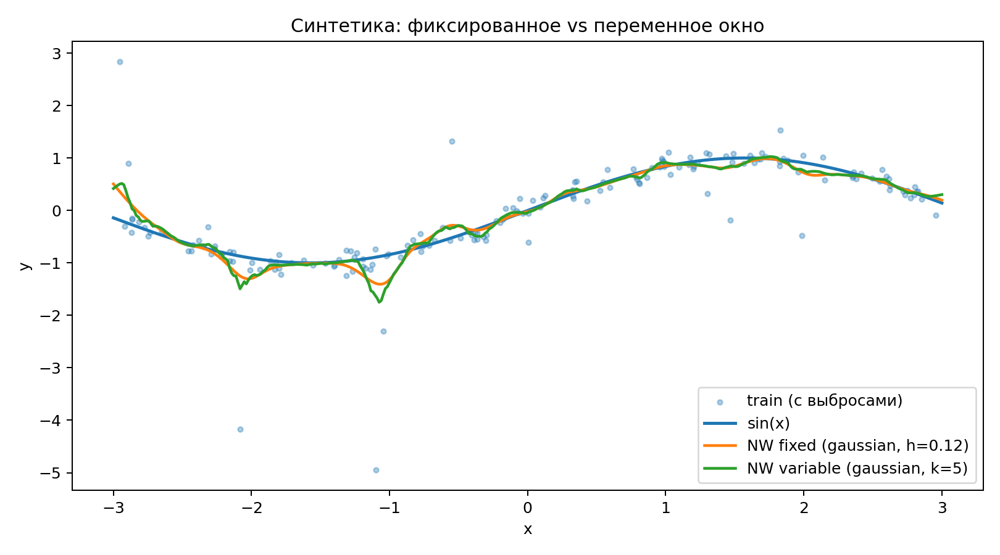

На синтетике LOO выбирает:
- фикс. окно: `gaussian`, $h = 0.12$, LOO RMSE = 0.531
- перем. окно: `gaussian`, $k = 5$, LOO RMSE = 0.530

Разница — третий знак после запятой. **Переменное окно выигрывает, когда плотность объектов сильно неоднородна** (на краях $x \in [-3, 3]$ соседи разрежены). Для равномерного $\sin(x)$ обе схемы дают практически одинаковый результат.

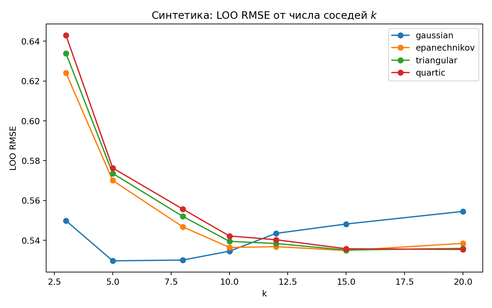

### 4.3. Влияние выбросов

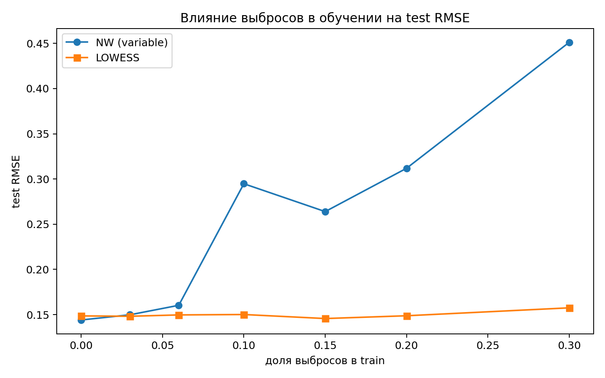

Test RMSE при росте доли выбросов **в train** (источник — `report_outputs/tables/lowess_outlier_comparison.csv`):

| доля выбросов | NW (variable) | LOWESS |
|---|---|---|
| 0.00 | 0.144 | 0.149 |
| 0.03 | 0.150 | 0.148 |
| 0.06 | 0.160 | 0.150 |
| 0.10 | 0.295 | 0.150 |
| 0.15 | 0.264 | 0.146 |
| 0.20 | 0.312 | 0.149 |
| 0.30 | 0.451 | 0.157 |

LOWESS становится строго лучше начиная примерно с **6–10 % выбросов**. При 30 % загрязнения NW проигрывает почти в 3 раза. До 3 % загрязнения LOWESS чуть хуже NW (≈1 %): робастность не достаётся бесплатно, есть небольшая «налогообложение» эффективности на чистых данных.

### 4.4. LOWESS: прогноз до и после перевзвешивания

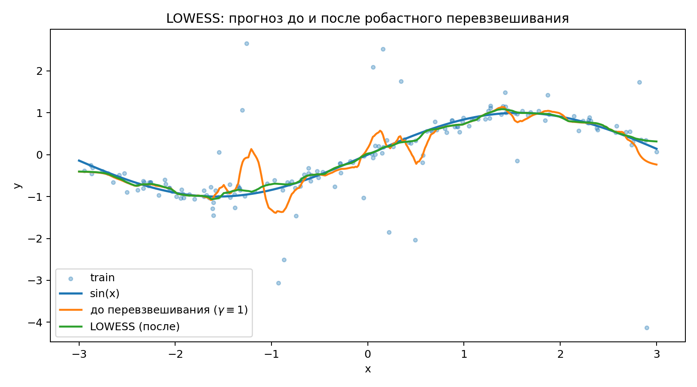
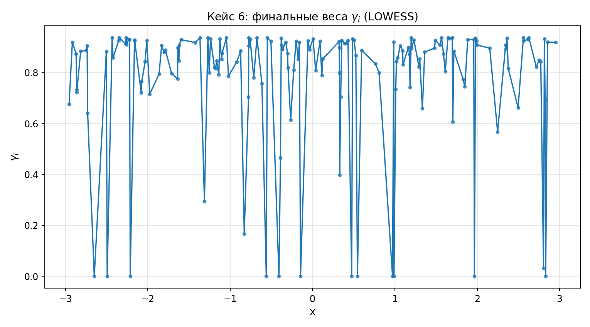

На объектах с большим $|a_i - y_i|$ итоговое $\gamma_i$ близко к нулю. Кривая «после» (LOWESS) практически совпадает с истинной $\sin(x)$, тогда как «до» (NW с $\gamma\equiv 1$) видимо сдвигается к выбросам.

### 4.5. Одномерная синтетика — иллюстрация роли h

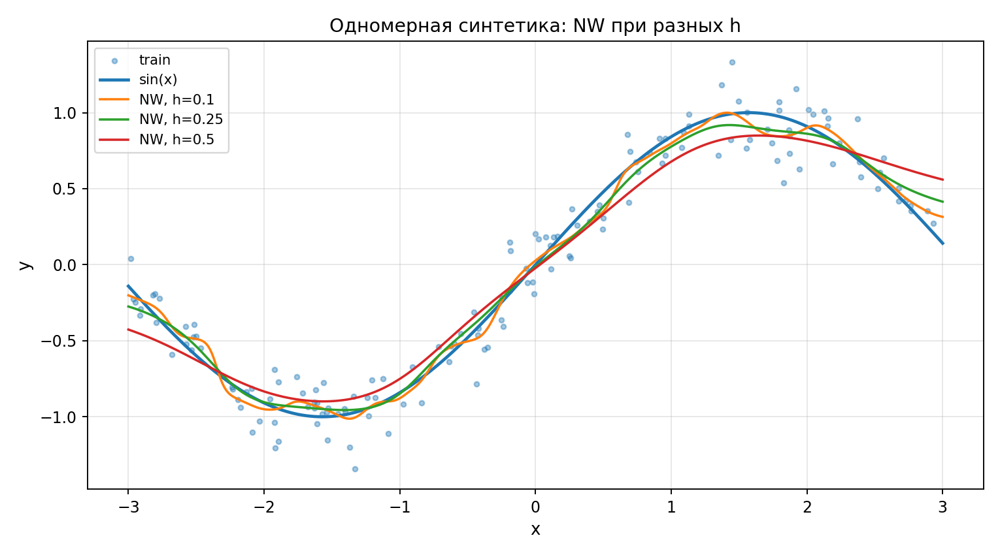

При $h = 0.1$ — переобучение (видны зазубрины), $h = 0.5$ — переcглаживание, $h \approx 0.25$ оптимально.

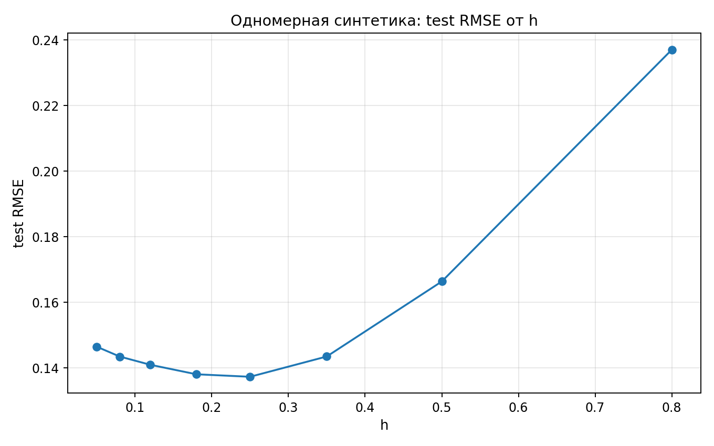

### 4.6. Реальные датасеты

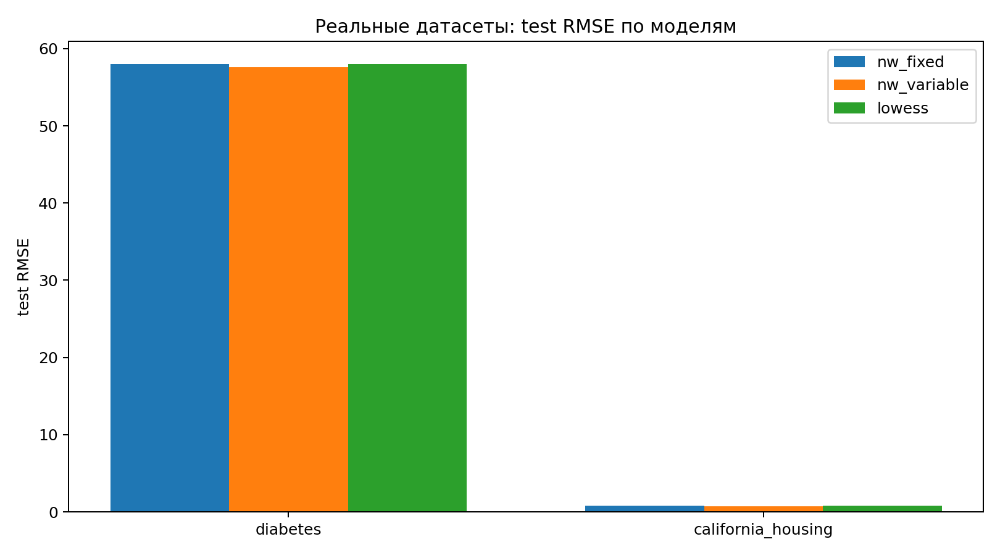

Источник — `report_outputs/tables/real_datasets_metrics.csv`:

**Diabetes** ($\bar y = 151$, $\sigma_y = 76$):

| модель | ядро | param | LOO RMSE | test RMSE | test MAE | test $R^2$ |
|---|---|---|---|---|---|---|
| nw_fixed | epanechnikov | h=2.93 | 58.89 | 57.98 | 47.58 | 0.458 |
| nw_variable | quartic | k=40 | 57.62 | 57.61 | 46.55 | 0.465 |
| lowess | triangular | k=20 | 58.22 | 58.03 | 46.49 | 0.457 |

**California Housing** ($\bar y = 2.08$, $\sigma_y = 1.15$ — целевая в $10^5$ долларов):

| модель | ядро | param | LOO RMSE | test RMSE | test MAE | test $R^2$ |
|---|---|---|---|---|---|---|
| nw_fixed | gaussian | h=0.54 | 0.691 | 0.783 | 0.562 | 0.590 |
| nw_variable | quartic | k=20 | 0.649 | 0.725 | 0.500 | 0.648 |
| lowess | quartic | k=20 | 0.697 | 0.766 | 0.509 | 0.608 |

**Наблюдения по реальным данным:**
- Переменное окно лучше фиксированного на обоих датасетах (на California — заметнее, $R^2$ 0.65 vs 0.59). Это ожидаемо: реальные данные плотнее в центре облака и реже на краях.
- LOWESS не даёт выигрыша на чистых данных — в Diabetes и California «выбросов» в нашем смысле нет, поэтому робастность не приносит плодов и даже немного ухудшает.
- $R^2 \approx 0.46$ на Diabetes для NW — стандартный уровень для задач с 10 признаками и $n \approx 330$ (для сравнения, OLS-baseline ≈ 0.45–0.50). Ядерная регрессия не страдает от мультиколлинеарности, но в высокой размерности проседает из-за «проклятия» (volume концентрируется в оболочке шара).

### 4.7. Истинные vs предсказанные, остатки

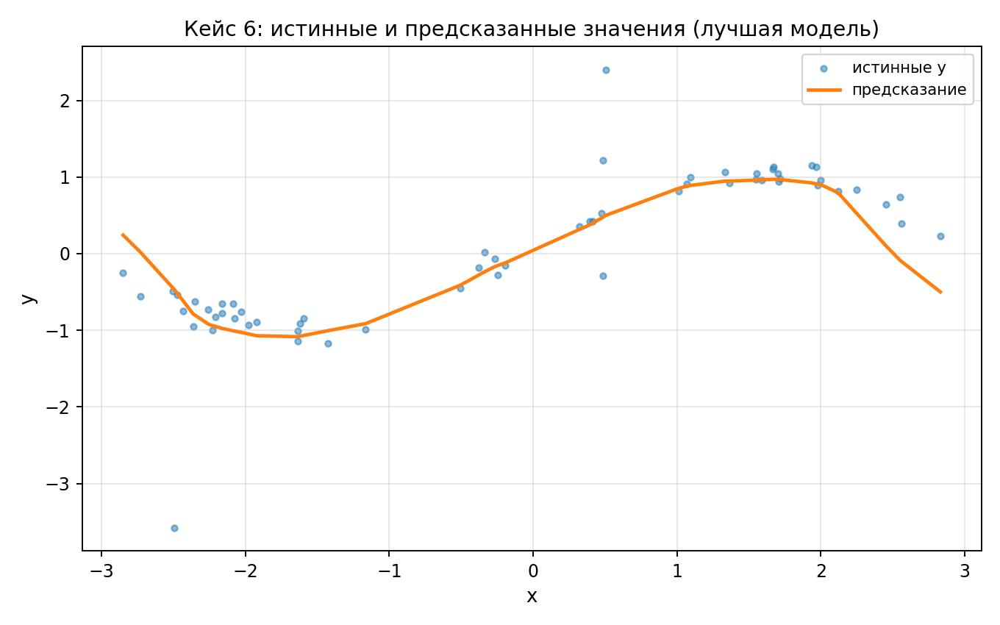
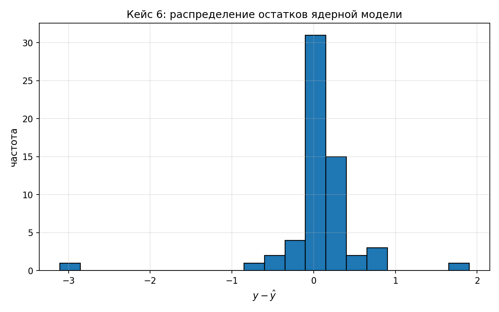

Гистограмма остатков почти симметрична, тяжёлый «правый хвост» отсутствует — модель не имеет систематических смещений.

---

## 5. Ответы на исследовательские вопросы из задания

**(1) Что влияет сильнее — выбор ядра или ширины окна?**
Окно. На синтетике размах LOO RMSE по $h$ — порядка 0.06; по ядрам при фиксированном $h$ — менее 0.002. На реальных данных картина та же: смена `gaussian → quartic` при правильно подобранном $h$ даёт изменения в 3-м знаке. Это согласуется с асимптотикой Парзена–Розенблатта: оптимальное $h$ задаёт скорость сходимости, ядро — только константу.

**(2) Когда переменное окно выигрывает?**
Когда плотность $p(x)$ неоднородна. На синтетике с равномерным $x$ выигрыш в третьем знаке; на California Housing (где признаки явно имеют разную плотность даже после стандартизации) — заметный выигрыш по $R^2$ (0.648 против 0.590).

**(3) При каком уровне выбросов LOWESS начинает выигрывать?**
Порог проходится около **6 %**: до этого NW чуть лучше или сравним, после — LOWESS строго лучше. При ≥10 % NW резко деградирует, LOWESS почти не реагирует.

---

## 6. Воспроизводимость

```bash
python3 -m venv .venv
source .venv/bin/activate
pip install -e .            # numpy, scipy, scikit-learn, matplotlib
pip install pytest jupyter

python3 -m pytest tests/case_6 -q     # 20 unit-тестов
PYTHONPATH=src python3 generate_report_assets.py   # перегенерирует все png/csv
jupyter notebook notebooks/case_6/case_6_demo.ipynb   # интерактивная визуализация
```

Все 20 тестов проходят. Run-to-run воспроизводимость обеспечена фиксированными `seed` в `np.random.default_rng`.

---

## 7. Сводка

| Пункт задания | Статус |
|---|---|
| 1. NW (fixed/variable) + LOWESS реализованы с нуля | ✅ |
| 2. LOO-подбор $h$, $k$, ядра | ✅ (включая LOWESS) |
| 3. Сравнение ≥3 ядер | ✅ (4: гауссовское, Епанечникова, треугольное, квартическое) |
| 4. Графики для 1D синтетики | ✅ |
| 5. Реальные датасеты с MAE/RMSE/$R^2$ | ✅ (Diabetes, California Housing) |
| 6. Сравнение NW vs LOWESS с выбросами | ✅ (7 точек по доле выбросов) |
| 7. График $\gamma_i$, до/после, гистограмма остатков | ✅ |
| 8. Исследовательские выводы | ✅ см. §5 |
